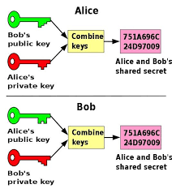

# Emerging_Trends_In_IT

## **IoT - Internet Of Things**
***
- The most exciting technology is of the future that impact us in a big way and those who use technology interested and for everyone else who use the **SnapChat**, these are things interested. First, **Internet Of Things - The internet of things takes the idea of putting a chip on every physical object** So Imagine a scenario where we Refrigerator knows the milk is running low in the milk the refrigenerator and on edge on order something at the local shopping and has the milk delivered.
- This is the simple example about Internet of Thing. There are more completed examples like Aeroplanes Engine can decide when to self repair themself because of maintenance cycle going low
- Next is **Big Data - Big Data all we know bulk amount of Data is Big Data** In the world of 2020, the estimated there will be **50 Billion GB** of Data in the world where it coming from. There is about **25 Billion Device** like Refrigenerator, iPhone, Aeroplane Engine, like every item we think of around us.
- **25 Million Apps** approximately so every app used today create some data and **4 Billion users** of 8 Billion people on earth using the internet in someway.
- To every image we take on Facebook, like every Emoji is the part of **50 Billion GB** of Data, what we do with these data how do we take these data and make some insights from it is called **Data Science**
- For Example New App Netflix, a popular content on Demand Service Netflix today has ability to decide for us What is the next movie they think we gonna watch based on all of the movies previously seen. So Everytime we see Comedy Movies they suggested accordingly
- Like the Amazon and Flipcart even YouTube they know what we look like. That's the power of Data Science behind the Big Data. Is doing the Analysis and finding insights and then preemptly telling about somehing which helps to you make decision rightly or wrongly
- Another Big movement Today in the business technology world is **Artificial Intelligence - Artificial Intelligent, So the big tech companies created something that takes Natural Language and does analysis not based on computer language** And started to become Machine so expert. It can start to analyse Medical Suiation, Human Behavior and many more etc and make recommendation like the Doctor. So Artificial Intelligence become a big way of change in the future.

## **Cloud - Large Computing Capacity**
***
- ***What is cloud?***
  - The cloud is the large set of computers sitting on words called **Server Farms** in very large tracks of land.
  - Ex - Amazon Cloud, Apple iCloud, **Server-farm land about 20 to 30 Cricket Grounds** of size of just computers and this is where everything we every photo we take, hit like button is stored . That's the Cloud Really
  - So, The Cloud is big set of Computers stored in these places. Equally in India we have a lot of Local Providers that provides the Cloud

- ***What is Cloud do? - Data, Applications, Hardware***
  - The Cloud allow us to stored data, to store application and we can also rent computer usage. We don't need to buy computer anymore And There is subsidiary of Amazon called AWS where we can rent the just usage of computer.
  - The most important I think is something called **Cloud Foundary** where we can build applications for the cloud
  
- ***Security-Threats from all Directions***
  - All of these creates a large number of security threats.
  
  > ***hacked - Target Cop in 2013 information from 130 million Credit Cards and debit cards was stolen***
  
  > ***wikileaks -Unauthorized access and the hacking of confidential data to publish secret information through anonymous sources***
  
  - Security is big element we need to keep in mind and that something protecting against security, cyber security is becoming a huge area in technology space
  
  - Then, A Couple of Interesting products in terms of services
  
  - **Disruptive Products - Driverless Car**, where it can detect obstacle, It doesn't need to driver. It can sense lense Badly it not driven in Mumbai yet. We have to want and see how they have gone to features that.
  
  - **Disruptive Products - hololens**, where we can see **Virtual Reality** In the virtual reality we can do things like 3D Object Visualization and Gaming Also Designed of Complicated Engineering Solutions by looking through the glass
  

## **Digital Disruptors**
***
- 7 Areas of Technology changed Business today.
- Huge area of disruption, Discruption really come not just from Technology But Also How you use Technology
- Example - The technology itself is not that complicated, at the end how to book a hotel room is not a complicated way of building software But the concept of using vacant room world wide into Hotelling System. The leverage of technology into Business Model is what creates real value in Business
- **The World Of Technology changing Fast** There we see a lot of opportunity for everything that happening in the world around us.
- If you have ways to connect with people, if you have to do predict some analysis, if your have ways to improve lifes. All of these technology can make huge impact and huge benefits.

## **Block-Chain**
***
- What is block chain?, How it might be catalyst in finance?
- **Block-Chain & Money, Block-Chain & Finance, BitCoin and Making Money**
- Go back to internet -> **Internet started many decades ago**
  - ***The Internet : Layers of Open Protocols***
  
- **Ethernet (1974)**
  - Ethernet which is raally help two computer to communicate
  - **TCP/IP - 1974**, which is really a intenet protocol of multiple computers to communicate with each other
  - **HTTP - 1990**, It's a protocol to communicate web content, **Hypertext Transfer Protocol**

- 1995, Cyber Thriller President a& Defense Department But Actually **Pizza Hut in 1994 : First Sale** very first sale started online. There is a websitr if you ant to order, order pizza online. But one problem, may be multiple, You can't pay online. No one know How to move money online
  - So, **CryptoCurrency?**
  - It's a technology or science behind encryption and decryption, so how do you encrypt a particular text such that it's not eadble by someone else without having decryption
 
- ***Crytography :- Communication in presence of adversaries***
- 
- In Movie **Imitation game**, ***Enigma - Machine (1920)*** Turing cracked it, it did crack by an automated way -> Actually police & government cracked the automated way in 1930 -> then in 1970, Assymmetric CryptoCurrency today

## **Private Key, Public Key Cryptography**
- Heart of BitCoin & Block Chain
- Heart of Internet
- Early A lot of cryptographic Digital Currency failed on the internet
- |SSL/TLS 1996|
  |-------|
  | HTTP - 1990|
